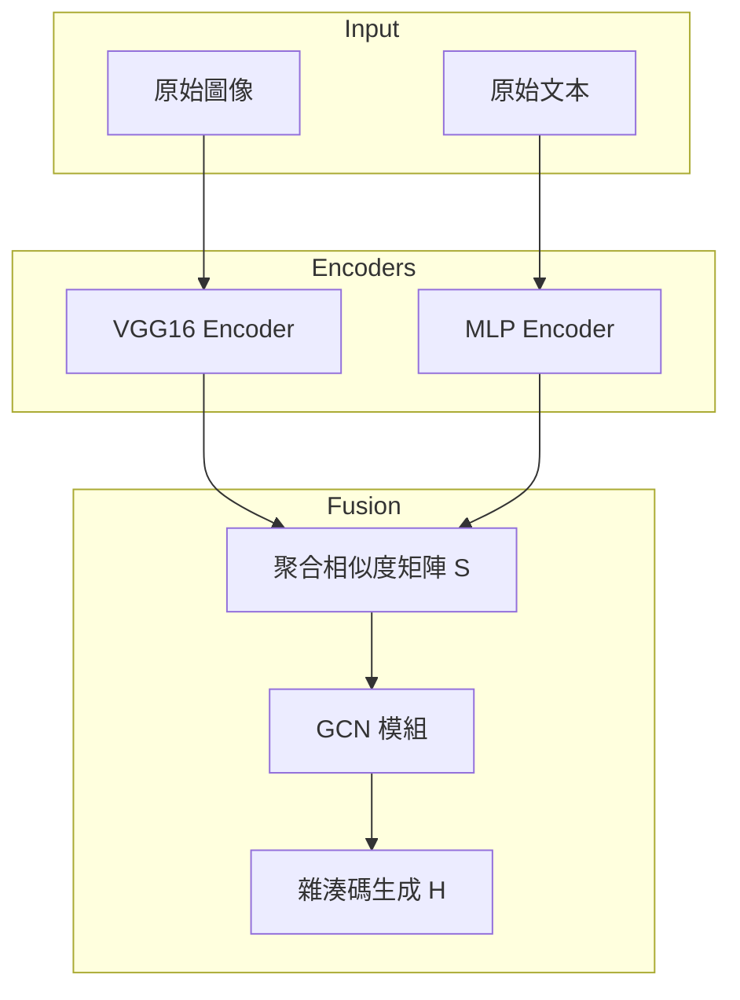

# AGCH-Impl

[](https://opensource.org/licenses/Apache-2.0)
[](https://www.python.org/downloads/)
[](https://www.pytorchlightning.ai/)

**AGCH-Impl** 是論文 **"Aggregation-based Graph Convolutional Hashing for Unsupervised Cross-Modal Retrieval"** 的高品質實作。本專案旨在實現一個無監督的跨模態檢索系統，透過聚合相似度矩陣與圖卷積網路 (GCN) 來提升檢索精度。

---

## 🚀 項目概覽

跨模態檢索（例如：以圖搜文、以文搜圖）面臨著異質性差異與無監督場景下缺乏語義引導的挑戰。AGCH 透過以下核心創新解決這些問題：

1.  **聚合相似度矩陣 (Aggregation Similarity Matrix)**: 結合了方向相關性（餘弦相似度）與維度差異資訊。
2.  **多模態深度編碼**: 結合 CNN (VGG16) 與 MLP 提取非線性特徵。
3.  **圖學習 (Graph Learning)**: 利用 GCN 的鄰域聚合能力，在無監督環境下挖掘數據流形結構。

### 系統架構



---

## 🛠️ 快速開始

### 1. 安裝環境

本專案強烈建議使用 [uv](https://github.com/astral-sh/uv) 進行依賴管理：

```bash
# 克隆專案
git clone https://github.com/natsuki221/AGCH-Impl.git
cd AGCH-Impl

# 安裝依賴 (包含 CUDA 12.8 支持)
uv sync --extra cuda128
```

或者使用 pip：

```bash
pip install -r requirements.txt
```

### 2. 數據準備

我們支持 **MIRFlickr-25K** 數據集。您可以使用自動化腳本下載並提取特徵：

```bash
# 下載數據、提取 VGG16 特徵並生成 HDF5 文件
python scripts/prepare_data.py
```

> [!NOTE]
> 該腳本將生成 `data/images.h5` 與 `data/texts.h5`，這兩個文件是模型訓練的基礎。

### 3. 模型訓練與實驗

執行標準的超參數調優實驗（16, 32, 64 bits）：

```bash
# 給予執行權限
chmod +x scripts/run_experiments.sh

# 執行實驗
./scripts/run_experiments.sh
```

---

## 📂 項目結構

```text
AGCH-Impl/
├── configs/            # Hydra 配置文件 (Model, Trainer, Data)
├── data/               # 數據目錄 (HDF5 文件, gitignore)
├── docs/               # 項目文件與論文參考
├── scripts/            # 數據準備與實驗自動化腳本
├── src/
│   ├── data/           # LightningDataModule 實作
│   ├── models/         # AGCH 核心模型與優化邏輯
│   └── train.py        # 訓練進入點
└── tests/              # 單元測試與整合測試
```

---

## 📊 效能基準 (Baseline)

在 MIRFlickr-25K 數據集上的預期 mAP 表現（16 bits）：

| 任務 | 預期 mAP |
| :--- | :--- |
| **I → T** (以圖搜文) | ~0.865 |
| **T → I** (以文搜圖) | ~0.829 |

---

## 引用 (Citation)

如果您在研究中使用了本實作，請引用以下論文：

```bibtex
@ARTICLE{9335490,
  author={Zhang, Peng-Fei and Li, Yang and Huang, Zi and Xu, Xin-Shun},
  journal={IEEE Transactions on Multimedia}, 
  title={Aggregation-Based Graph Convolutional Hashing for Unsupervised Cross-Modal Retrieval}, 
  year={2022},
  volume={24},
  number={},
  pages={466-479},
  keywords={Semantics;Convolutional codes;Binary codes;Convolution;Measurement;Feature extraction;Sparse matrices;Multimodal;unsupervised hashing;cross-modal search;graph convolutional networks},
  doi={10.1109/TMM.2021.3053766}}
```

## 📜 許可證

本專案採用 **MIT License**。詳見 [LICENSE](LICENSE) 文件。

## 📧 聯繫與引用

如果您在研究中使用了本實作，請考慮引用原始論文。
如有問題，請通過 [GitHub Issues](https://github.com/natsuki221/AGCH-Impl/issues) 進行交流。
