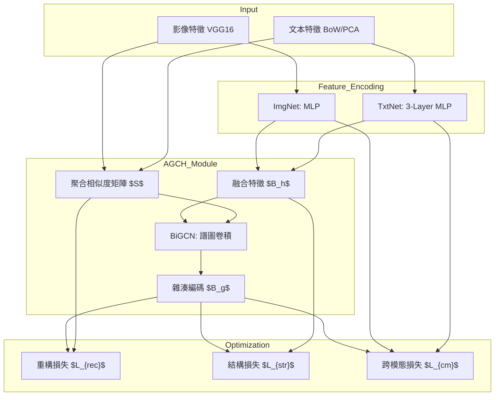

# 系統架構分析 (Architecture Analysis)

本文檔提供 AGCH-Impl 專案的詳細架構分析，基於對源代碼的全面掃描。

## 1. 系統縱覽

AGCH (Aggregation-based Graph Convolutional Hashing) 是一個用於無監督跨模態檢索的非對稱引導兼容雜湊模型。該專案基於 **PyTorch Lightning** 構建，具備高度的模組化與可擴展性。

### 核心流程圖

## 2. 模組組件

### 2.1 特徵編碼器 (`src/models/components.py`)

- **ImgNet**: 單層全連接網絡，將 4096 維影像特徵映射到雜湊空間。
- **TxtNet**: 三層 MLP (Linear -> ReLU -> Linear)，映射文本特徵。

### 2.2 圖卷積網絡 (`src/models/components.py`)

- **SpectralGraphConv**: 實作譜圖卷積運算 $H^{(l)} = A \cdot H^{(l-1)} \cdot W$，其中 $A$ 為相似度矩陣 $S$。
- **BiGCN**: 雙層 GCN 結構，隱藏層維度通常為 4096。

### 2.3 雜湊中心模組 (`src/models/agch_module.py`)

- **交替優化策略**:
  - **階段 1**: 更新特徵網絡 (F)，固定雜湊碼 (B)。
  - **階段 2**: 更新雜湊碼/GCN 參數 (B)，固定特徵網絡 (F)。

- **相似度矩陣聚合**: 考慮影像與文本的權重 $\gamma_v, \gamma_t$，基於餘弦相似度與歐氏距離構建 $S$。

## 3. 數據協議 (`src/data/agch_datamodule.py`)

- 使用 **HDF5** 格式存儲預提取特徵（images.h5, texts.h5）。
- 支援內存快取 (In-memory caching)，顯著提升訓練效率。
- 標準切分量 (MIRFlickr)：訓練 10k / 檢索 10k / 查詢 2k。

## 4. 評估指標 (`src/utils/metrics.py`)

- **mAP (Mean Average Precision)**: 基於 Hamming 距離的檢索性能評估核心指標。
- **Precision@k**: 評估前 k 個檢索結果的準確率。
